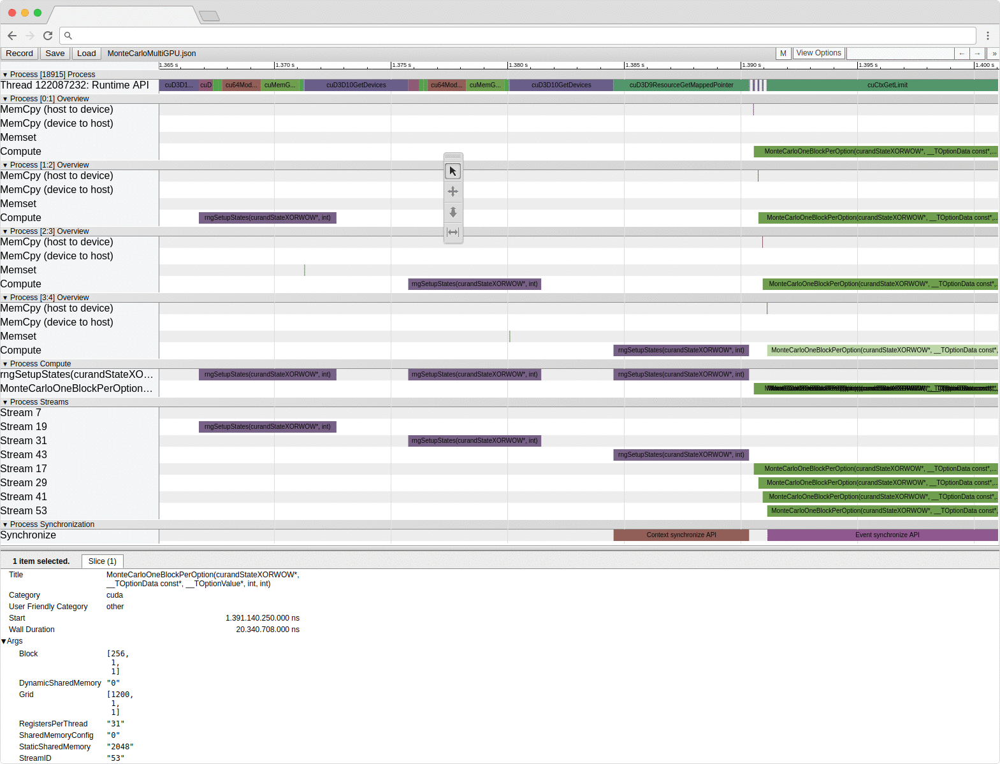

# nvprof2json

[](https://ci.patwie.com/PatWie/nvprof2json)

A small self-contained binary that converts the output of nvprof into a json file for visualization in the Chrome browser.
No external dependencies, just download the [latest release](https://github.com/PatWie/nvprof2json/releases) here from GitHub and run

```bash
nvprof -o main.nvvp ./main
nvprof2json -o main.json main.nvvp
```

Point the Chrome browsers to `chrome://tracing/` and load `main.json`

<p align="center">  </p>


```
Usage:
  nvprof2json [OPTIONS] file

Application Options:
  -o, --output=  output file for Chrome tracing (default: [nvvpfile].json)
  -v, --verbose  verbose logging
  -p, --pretty   ident and prettify JSON output
  -f             override output file if exists

Help Options:
  -h, --help     Show this help message

Arguments:
  file:          output from nvprof, e.g., 'nvprof -o [file] [your-app]'

```

**Alternatives**
There exists [proof-of-concept](https://github.com/ezyang/nvprof2json) written in Python with less features.
