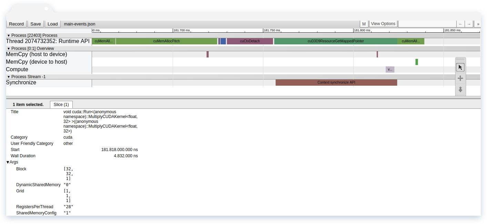

# nvprof2json

[](https://ci.patwie.com/PatWie/nvprof2json)

This converts the output of nvprof into a json file which can be visualized in the Chrome browsers.

```bash
nvprof -o main.nvvp ./main
nvprof2json main.nvvp -o main-events.json
```

Point the Chrome browsers to `chrome://tracing/` and load `main-events.json`

<p align="center">  </p>